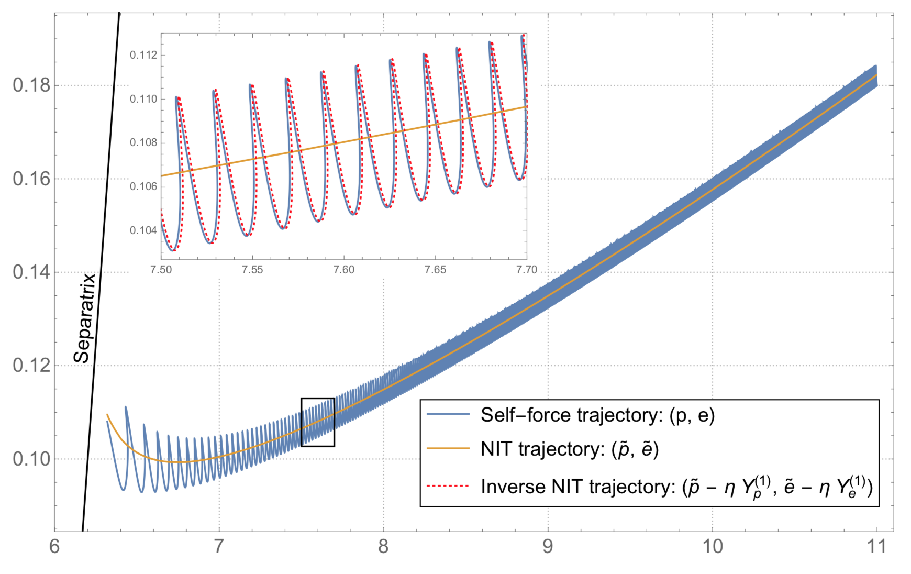

C++ code to compute self-force inspirals rapidly using the near-identity transformed (NIT’d) equations of motion

## Getting the package

The latest development version will always be available from the project git
repository:

```bash
git clone https://github.com/BlackHolePerturbationToolkit/Fast_Self-Forced_Inspirals.git
```

## Requirements, Installation and Usage

For details on these topics check out the [README](https://github.com/BlackHolePerturbationToolkit/Fast_Self-Forced_Inspirals/blob/master/README.md)

## Status

The NIT inspiral model is constructed using the self-force model from [N. Warburton et al.](https://arxiv.org/abs/1111.6908) Consequently it is only valid for Schwarzschild inspirals with initial parameters 0 <= e <0.2 and 6+2e < p < 12. This will be extended in the near future using the self-force model of [T. Osburn et al.](https://arxiv.org/abs/1511.01498) The plan is also to extend the model to generic inspirals in Kerr spacetime.

## Known problems

Known bugs are recorded in the project [bug tracker](https://github.com/BlackHolePerturbationToolkit/Fast_Self-Forced_Inspirals/issues).

## License

The code is licensed under the GPLv3 open-source licence. Details can be found in the LICENSE file.

## Authors

Niels Warburton    


## Citation Guideline

If you make use of this Toolkit module in your work please cite: M. van de Meent, N. Warburton, "Fast Self-forced Inspirals", arXiv:????.?????

We also ask that if you make use of any of the Toolkit in your research please acknowledge using:

> This work makes use of the Black Hole Perturbation Toolkit.
